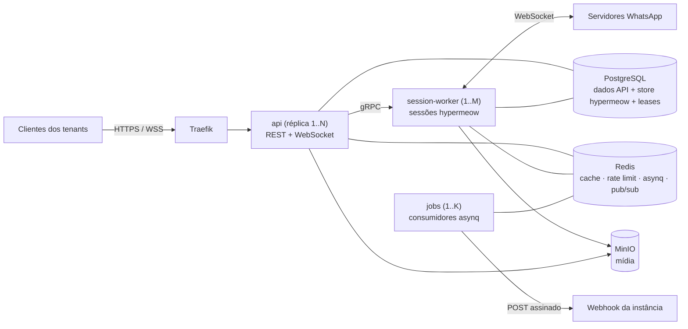
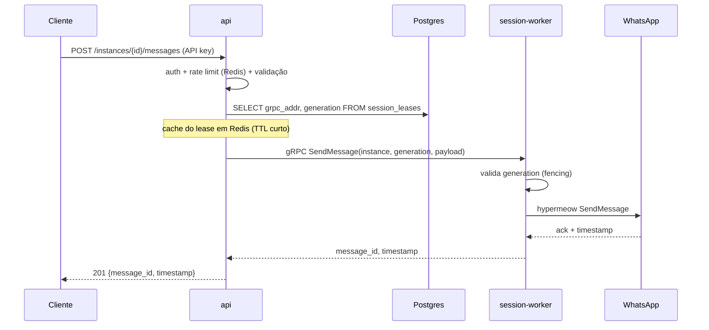
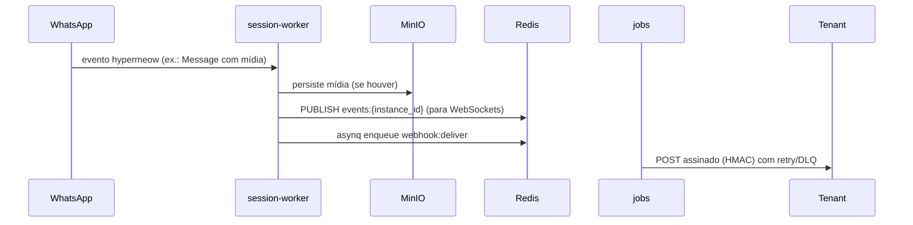

# Arquitetura de Serviços

Como a **zappermeow** se organiza em serviços, com foco na separação entre o plano **stateless** (API REST) e o plano **stateful** (sessões WhatsApp). Complementa [TECH_STACK.md](TECH_STACK.md) e [features.md](features.md).

## O problema central

Cada instância WhatsApp é uma conexão WebSocket persistente com estado criptográfico Signal. **Conectar o mesmo device em dois processos ao mesmo tempo corrompe esse estado.** Toda a arquitetura deriva dessa restrição:

- A **API REST** pode ter N réplicas idênticas atrás de load balancer — não guarda estado.
- As **sessões** vivem em workers dedicados, e cada sessão pertence a **exatamente um worker**, garantido por lease em Postgres.

## Modelo de contas e isolamento

Dois níveis de contas, com a **instância** (um número WhatsApp) como unidade de isolamento:

```
Plataforma (super-admin, JWT de plataforma)
└── Tenant (admin com login próprio → JWT de tenant)
    └── Instância (número WhatsApp; 1 instância = 1 sessão = 1 lease)
        ├── API keys (N, hash no Postgres, revogáveis)
        └── Webhooks (URL + filtro de eventos + segredo HMAC)
```

- O **operador da plataforma** cria e gerencia tenants (e seus limites de uso).
- Cada **tenant** é um admin da plataforma: faz login e gerencia suas próprias instâncias — cria números, pareia via QR, emite API keys, configura webhooks. Um tenant tem **N instâncias**.
- Cada **instância** carrega suas próprias credenciais: API keys e webhooks pertencem à instância, não ao tenant. Vazamento ou rotação de credenciais de um número não afeta os demais, e sistemas distintos do tenant podem consumir números distintos.

Garantias de isolamento:

- **Entre tenants:** toda rota autenticada por JWT de tenant valida `instance.tenant_id == jwt.tenant_id`; um tenant nunca enxerga instâncias de outro.
- **Entre instâncias do mesmo tenant (plano operacional):** a API key de uma instância só opera aquela instância — a api valida que a key pertence à instância da URL.
- **Mídia:** object keys no MinIO prefixadas por `tenant_id/instance_id`.
- **Rate limiting:** por API key (= por instância), com limites configuráveis por tenant.

## Visão geral



## Os três papéis do binário

Um único binário/imagem (`zappermeow`), três subcomandos — cada um vira um service no Swarm:

| Papel | Comando | Estado | Escala |
| --- | --- | --- | --- |
| **api** | `zappermeow serve` | Stateless | Horizontal livre (2+ réplicas) |
| **session-worker** | `zappermeow session-worker` | Stateful (sessões) | Por capacidade (~100–300 sessões/worker) |
| **jobs** | `zappermeow jobs` | Stateless | Pela profundidade das filas |

### api (`zappermeow serve`)

Porta de entrada de todo tráfego externo. Responsabilidades:

- Rotas operacionais REST (huma/chi): autenticação por API key **da instância**, rate limiting (redis_rate), validação, OpenAPI.
- Rotas de plataforma (JWT de plataforma): gestão de tenants e seus limites.
- Rotas de tenant (JWT de tenant): CRUD das próprias instâncias, API keys, webhooks e pareamento.
- WebSocket por instância (`/instances/{id}/ws`): assina canais Redis pub/sub e retransmite eventos ao cliente (QR code, mensagens recebidas, status de conexão).
- Operações que **não** precisam da sessão vão direto: consultas ao Postgres (histórico de instâncias, configuração), URLs pré-assinadas do MinIO.
- Operações que precisam da sessão viram **chamadas gRPC ao worker dono do lease**.

Não importa qual réplica atende o request — nenhuma guarda estado. Sticky session do Traefik só se aplica aos WebSockets.

### session-worker (`zappermeow session-worker`)

Dono das conexões WhatsApp. Responsabilidades:

- Manter os clientes hypermeow das sessões cujo lease possui (conexão, keepalive, reconexão com backoff).
- Servir **gRPC** na overlay network para os comandos síncronos da API (enviar mensagem, criar grupo, buscar contato...).
- Traduzir os ~75 tipos de evento do hypermeow em eventos de domínio e despachá-los:
  - **Redis pub/sub** (`events:{instance_id}`) → consumido pelas réplicas da api para os WebSockets;
  - **asynq** → tasks de entrega de webhook com retry;
  - **MinIO** → download/persistência de mídia recebida antes de emitir o evento (o evento referencia a object key).
- Heartbeat dos leases e reconciliação (ver abaixo).

### jobs (`zappermeow jobs`)

Consumidores asynq, sem estado de sessão:

- Entrega de webhooks (POST assinado HMAC, retry exponencial, DLQ).
- Campanhas/broadcast: quebra o lote em tasks individuais que chamam o worker via gRPC respeitando o rate da sessão.
- Manutenção: expiração de mídia, limpeza de eventos antigos.

Em volume baixo, `jobs` pode rodar colocado nas réplicas da api (flag `--with-jobs`); separa-se quando a fila crescer.

## Posse de sessão: leases em Postgres

Tabela `session_leases` — a única fonte de verdade sobre quem detém cada sessão:

```sql
CREATE TABLE session_leases (
    instance_id   uuid PRIMARY KEY REFERENCES instances(id),
    worker_id     text,                    -- identidade do processo (hostname+task-id do Swarm)
    grpc_addr     text,                    -- endereço gRPC do worker na overlay network
    generation    bigint NOT NULL DEFAULT 0, -- fencing token: incrementa a cada aquisição
    heartbeat_at  timestamptz,
    desired_state text NOT NULL DEFAULT 'running' -- running | stopped | draining
);
```

**Aquisição (atômica):**

```sql
UPDATE session_leases
SET worker_id = $1, grpc_addr = $2, generation = generation + 1, heartbeat_at = now()
WHERE instance_id = $3
  AND desired_state = 'running'
  AND (worker_id IS NULL OR heartbeat_at < now() - interval '30 seconds')
RETURNING generation;
```

- **Heartbeat:** o worker renova `heartbeat_at` a cada 10s para todos os seus leases (um único UPDATE em lote).
- **Failover:** worker morre → heartbeats param → após 30s os leases ficam elegíveis → os workers vivos os adquirem no ciclo de reconciliação e reconectam as sessões. Downtime por sessão: ~30–60s, sem intervenção manual.
- **Fencing:** o `generation` acompanha toda chamada gRPC e todo evento emitido; um worker que perdeu o lease (ex.: pausa longa de GC) tem suas operações rejeitadas ao comparar generations — nunca há dois donos efetivos.
- **Reconciliação:** a cada 15s cada worker compara sua capacidade com os leases disponíveis e adquire sessões órfãs até o limite (`MAX_SESSIONS_PER_WORKER`). Distribuição emergente, sem coordenador central — suficiente para a escala alvo de centenas de sessões.
- **Shutdown gracioso (deploy):** ao receber SIGTERM o worker marca-se como draining, solta os leases (worker_id = NULL, heartbeat_at = NULL), desconecta as sessões de forma limpa e os demais workers as adotam em segundos. Rolling update do Swarm com `stop_grace_period` folgado.

## Fluxos principais

### Envio de mensagem (síncrono)



Se o gRPC falhar porque o lease mudou de dono (worker respondeu `WRONG_GENERATION` ou conexão recusada), a api invalida o cache, relê o lease e tenta uma vez no novo endereço antes de devolver erro.

### Evento recebido (mensagem, recibo, QR...)



A task `webhook:deliver` resolve a configuração de webhook **da instância** (URL, filtro de tipos de evento, segredo HMAC) antes de entregar — instâncias diferentes do mesmo tenant podem apontar para consumidores diferentes.

### Pareamento (QR code)

1. `POST /instances/{id}/connect` → api localiza/dispara aquisição de lease e chama `Connect` via gRPC.
2. Cliente abre `GET /instances/{id}/ws` (ou aguarda webhook).
3. Worker recebe os eventos `QR` do hypermeow → publica no canal Redis → api entrega pelo WebSocket.
4. `PairSuccess` → worker persiste, emite evento de conexão estabelecida.

## Topologia no Swarm

| Service | Réplicas | Placement | Observações |
| --- | --- | --- | --- |
| traefik | 1–2 | nodes de borda | TLS, sticky p/ WS |
| api | 2+ | qualquer node | stateless |
| session-worker | 2–3 | nodes com mais RAM | `stop_grace_period: 60s` |
| jobs | 1+ | qualquer node | escala pela fila |
| postgres | 1 | node com volume | backup contínuo (WAL) |
| redis | 1 | node com volume | AOF ligado (filas asynq) |
| minio | 1 | node com volume | lifecycle policies |

- Toda comunicação interna (gRPC, Postgres, Redis) trafega em **overlay network** privada; só o Traefik publica portas.
- O gRPC dos workers **não** usa o VIP do Swarm — a api disca o `grpc_addr` específico registrado no lease (endereço do task na overlay), porque o destinatário precisa ser o dono da sessão, não um worker qualquer.

## Estrutura de diretórios proposta

```
zappermeow/
├── cmd/zappermeow/            # main: subcomandos serve | session-worker | jobs
├── internal/
│   ├── api/                 # handlers huma, middlewares (auth, rate limit), ws
│   ├── worker/              # gerência de sessões, adapter hypermeow, servidor gRPC
│   ├── jobs/                # consumidores asynq (webhooks, campanhas)
│   ├── lease/               # aquisição, heartbeat, reconciliação, fencing
│   ├── events/              # tradução eventos hypermeow → domínio, pub/sub
│   ├── domain/              # entidades: tenant, instance, api_key, webhook, message
│   ├── store/               # sqlc gerado + queries (tabelas da API)
│   ├── media/               # cliente MinIO, URLs pré-assinadas
│   └── config/              # env + secrets
├── proto/                   # contratos gRPC api↔worker
├── migrations/              # golang-migrate (só tabelas da API)
└── deploy/                  # stack.yml do Swarm, Dockerfile
```

## Decisões e razões (resumo)

| Decisão | Razão |
| --- | --- |
| api e session-worker separados | Sessões são stateful; API escala horizontal sem tocar nelas |
| gRPC no caminho síncrono | REST do tenant responde na hora (message_id real); tipado; streaming p/ QR |
| Lease em Postgres com fencing | Duplo-connect corrompe estado Signal — a garantia fica no storage mais durável |
| Reconciliação descentralizada | Na escala de centenas de sessões, workers auto-organizados bastam; sem coordenador |
| Binário único multi-role | Um build, uma imagem, código de domínio compartilhado sem versionamento interno |
| Eventos via Redis pub/sub + asynq | Pub/sub para tempo real (WS), asynq para entrega garantida (webhooks) |
| API keys e webhooks por instância | Isolamento por número: vazamento/rotação de credenciais de um número não afeta os demais; sistemas distintos consomem números distintos |

## Limites conhecidos e evolução

- **Escala além de milhares de sessões:** a reconciliação por varredura e o lease por linha continuam corretos, mas valeria consistent hashing para distribuir melhor e drain incremental por lotes.
- **Postgres/Redis/MinIO com 1 réplica:** pontos únicos de falha aceitos no estágio inicial; mitigar com backup WAL + AOF e, depois, réplica de leitura/Sentinel.
- **Campanhas de alto volume:** o rate limiting por sessão no worker (fila interna por instância) precisa ser especificado quando a feature de broadcast entrar.
