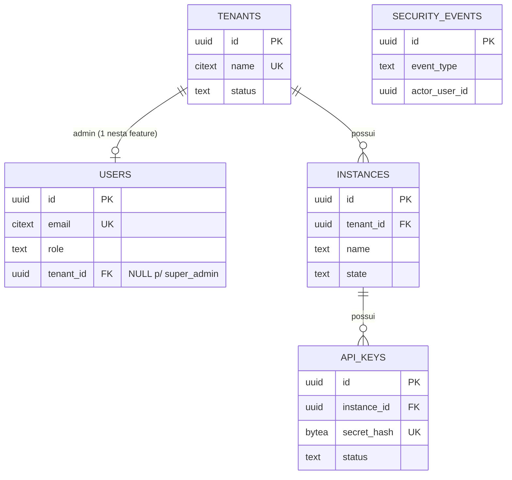

# Data Model — Fundação de Contas (001-account-foundation)

**Date**: 2026-08-12 | **Plan**: [plan.md](./plan.md) | **Research**: [research.md](./research.md)

Todas as tabelas pertencem ao schema da API (migração `0001_account_foundation`, golang-migrate). Nenhuma tabela do HyperMeow é criada nesta feature. Identificadores são UUID v7 gerados pela aplicação (ordenáveis por tempo, sem extensão PG necessária). Timestamps `timestamptz` em UTC.

## Diagrama (entidade-relacionamento)

## Tabelas

### tenants

Cliente da plataforma (US1, US4).

| Coluna | Tipo | Regras |
| --- | --- | --- |
| `id` | `uuid` | PK |
| `name` | `citext` | NOT NULL, UNIQUE (case-insensitive — FR-005), 1..120 chars |
| `status` | `text` | NOT NULL, CHECK IN (`active`, `suspended`), default `active` |
| `created_at` / `updated_at` | `timestamptz` | NOT NULL |

**Transições de estado**: `active ⇄ suspended` (suspend/activate, só super-admin); exclusão é DELETE físico com cascata (FR-007) mediante confirmação explícita no request. Não há estado `deleted` (decisão da descoberta: exclusão irreversível).

### users

Pessoa que autentica por email/senha (US1, US2, US5, US6). Nesta feature: 1 super-admin global + 1 admin por tenant.

| Coluna | Tipo | Regras |
| --- | --- | --- |
| `id` | `uuid` | PK |
| `name` | `text` | NOT NULL, 1..120 chars |
| `email` | `citext` | NOT NULL, UNIQUE global (FR-005), formato validado na aplicação |
| `password_hash` | `text` | NOT NULL, formato PHC Argon2id (R1); nunca exposto em API/log |
| `role` | `text` | NOT NULL, CHECK IN (`super_admin`, `tenant_admin`) |
| `tenant_id` | `uuid` | FK → tenants ON DELETE CASCADE; NULL ⇔ `role = super_admin` (CHECK) |
| `must_change_password` | `boolean` | NOT NULL default false; true após reset (US5) — token emitido só permite troca de senha |
| `failed_login_count` | `int` | NOT NULL default 0 (R4) |
| `locked_until` | `timestamptz` | NULL = não bloqueada; bloqueio ativo se `locked_until > now()` (FR-017, durável — FR-020) |
| `password_changed_at` | `timestamptz` | NOT NULL default now(); atualizado em toda troca/reset de senha — middlewares rejeitam tokens com `iat` anterior (SC-004) |
| `created_at` / `updated_at` | `timestamptz` | NOT NULL |

**Regras de senha**: mínimo 8 chars (FR-022); troca exige senha atual (FR-015); senha temporária de reset é aleatória, mesma validação, uso único via `must_change_password` (US5).

**Lockout**: falha de login → `failed_login_count++` (transacional); ao atingir N (config, default 5) → `locked_until = now() + janela` (default 15min) e contador zerado; sucesso → zera contador. Desbloqueio é passivo (comparação com `now()`), sem job; o evento `account_unlocked` é registrado no primeiro login bem-sucedido após a expiração do bloqueio.

### instances

Registro de um futuro dispositivo vinculado a um número WhatsApp (US2). Sem pareamento nesta feature.

| Coluna | Tipo | Regras |
| --- | --- | --- |
| `id` | `uuid` | PK |
| `tenant_id` | `uuid` | NOT NULL, FK → tenants ON DELETE CASCADE |
| `name` | `text` | NOT NULL, 1..120 chars; único por tenant (UNIQUE tenant_id + lower(name)) |
| `state` | `text` | NOT NULL, CHECK IN (`registered`) — estados de pareamento/conexão entram em feature futura sem migração destrutiva (novos valores no CHECK) |
| `created_at` / `updated_at` | `timestamptz` | NOT NULL |

Índice: `(tenant_id)` para listagem por tenant.

### api_keys

Credencial operacional da instância (US3).

| Coluna | Tipo | Regras |
| --- | --- | --- |
| `id` | `uuid` | PK |
| `instance_id` | `uuid` | NOT NULL, FK → instances ON DELETE CASCADE (FR-012: exclusão da instância revoga na prática — cascade remove) |
| `label` | `text` | NULL (rótulo opcional), ≤ 60 chars |
| `key_prefix` | `text` | NOT NULL — primeiros 12 chars do token (`zmk_xxxxxxxx`), exibível em listagens (FR-011) |
| `secret_hash` | `bytea` | NOT NULL, UNIQUE — SHA-256 do token completo (R2); lookup de autenticação por este índice |
| `status` | `text` | NOT NULL, CHECK IN (`active`, `revoked`), default `active` |
| `created_at` | `timestamptz` | NOT NULL |
| `revoked_at` | `timestamptz` | NULL; preenchido na revogação (imutável — key revogada nunca reativa) |

**Transições**: `active → revoked` (uma via). Segredo completo existe apenas na resposta da criação (SC-006). Verificação operacional exige, na mesma consulta: key `active` + instância da URL + tenant `active` (cascata de suspensão — US4/FR-006).

### security_events

Registro rastreável de ações sensíveis (FR-021, SC-007). Append-only — sem UPDATE/DELETE.

| Coluna | Tipo | Regras |
| --- | --- | --- |
| `id` | `uuid` | PK |
| `event_type` | `text` | NOT NULL — `login_succeeded`, `login_failed`, `account_locked`, `account_unlocked`, `password_changed`, `password_reset`, `tenant_created`, `tenant_updated`, `tenant_suspended`, `tenant_activated`, `tenant_deleted`, `instance_created`, `instance_updated`, `instance_deleted`, `api_key_created`, `api_key_revoked`, `bootstrap_admin_created` |
| `actor_user_id` | `uuid` | NULL (login falho de email inexistente não tem ator) — sem FK para sobreviver à exclusão do ator |
| `target_type` / `target_id` | `text` / `uuid` | NULL — alvo da ação (tenant, user, instance, api_key) |
| `result` | `text` | NOT NULL, CHECK IN (`success`, `failure`, `denied`) |
| `source_ip` | `inet` | NULL |
| `metadata` | `jsonb` | NOT NULL default `{}` — detalhes por tipo (ex.: key_prefix, audience); NUNCA contém segredos |
| `created_at` | `timestamptz` | NOT NULL |

Índices: `(created_at)`, `(event_type, created_at)`, `(actor_user_id, created_at)`.

## Invariantes de integridade (verificáveis em teste)

1. **Cadeia de isolamento**: `api_keys.instance_id → instances.tenant_id` — toda validação operacional resolve a cadeia inteira e nega se a instância da URL ≠ instância da key (FR-013) ou tenant suspenso (FR-006).
2. **Cascata de exclusão**: DELETE de tenant remove users, instances e api_keys por FK CASCADE em uma transação (FR-007); DELETE de instância remove suas keys (FR-012). Exclusões em cascata registram apenas o evento pai (`tenant_deleted`/`instance_deleted`), com as contagens dos recursos removidos no `metadata` — não há eventos filhos por recurso (decisão R9).
3. **Unicidade**: email global (`users.email` citext UNIQUE), nome de tenant global (`tenants.name` citext UNIQUE), nome de instância por tenant, `secret_hash` global.
4. **Super-admin sem tenant**: CHECK `(role = 'super_admin' AND tenant_id IS NULL) OR (role = 'tenant_admin' AND tenant_id IS NOT NULL)`.
5. **Segredos irrecuperáveis**: nenhuma coluna armazena segredo em claro (senha → Argon2id PHC; key → SHA-256); nenhuma query sqlc retorna `password_hash`/`secret_hash` para camada de API.
6. **Bloqueio durável**: estado de lockout sobrevive a restart do serviço e do Redis (vive em `users`).

## Dados efêmeros (Redis — fora do modelo persistente)

| Chave | Uso | TTL |
| --- | --- | --- |
| `rl:login:{ip}` | GCRA redis_rate — limite por origem no login (FR-018) | janela do limiter |
| `rl:op:{key_id}` | GCRA redis_rate — rate limit da rota operacional por API key (constituição, Princípio II) | janela do limiter |

Perda do Redis não perde dado de conta (apenas relaxa temporariamente os limiters — aceito; lockout por conta continua valendo via Postgres).
